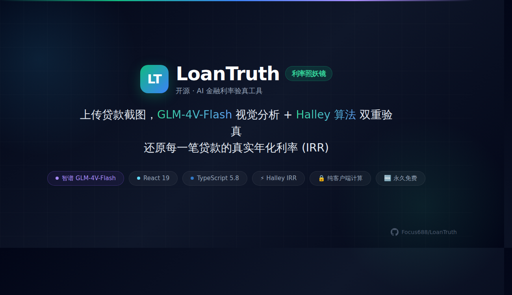

<div align="center">



# LoanTruth · 利率照妖镜

**上传一张贷款截图，AI 帮你撕开金融产品的画皮**

[](https://opensource.org/licenses/MIT)
[](https://react.dev)
[](https://www.typescriptlang.org/)
[](https://vitejs.dev)
[](https://bigmodel.cn)
[](CONTRIBUTING.md)

**🌍 帮助全球年轻人看懂利率陷阱，拒绝被收割**

</div>

---

## 为什么要做这件事？

> **全球有数十亿年轻人正在被高利息贷款毁掉一生。**
>
> 他们不是不聪明——他们只是对利率的认知被刻意模糊了。
>
> "日息万五"听起来很便宜，"月费率0.6%"看起来很低，但数学不会骗人。

**LoanTruth 的使命就一句话：**

> **用数学和 AI 撕开金融产品的画皮，帮一个是一个。**

---

## 它能做什么？

| 功能 | 说明 |
|------|------|
| 📸 **截图上传** | 支持多图拼接（首页广告 + 还款计划表） |
| 🤖 **AI 识别** | Gemini 2.5 Flash 自动提取本金、期数、隐藏费用 |
| 🧮 **算法验真** | Newton-Raphson IRR 本地计算，双重验证 |
| 🚨 **陷阱检测** | 砍头息、保险费捆绑、提前还款违约金 |
| 💰 **收入负担比** | 输入月收入，计算你离崩溃还有多远 |
| ⛔ **债务循环警告** | 以贷养贷 = 慢性自杀，AI 告诉你为什么 |
| 🎲 **投资警告** | 不要靠股票/币圈/赌博翻身——事实是 90% 的人亏得更惨 |
| 🛟 **生存路线图** | 具体、可执行的摆脱债务步骤 |

---

## 快速开始

### 在线体验

[GitHub Pages](https://focus688.github.io/LoanTruth/)

### 本地运行

```bash
# 1. 克隆
git clone https://github.com/Focus688/LoanTruth.git
cd LoanTruth

# 2. 安装依赖
npm install

# 3. 配置智谱 GLM-4.6V-Flash API 密钥
#    去 https://bigmodel.cn 注册，免费获取 API Key
echo "VITE_ZHIPU_API_KEY=你的key" > .env.local

# 4. 启动
npm run dev
```

> 🆓 Gemini API 有免费额度，够日常使用。

### 技术栈

| 层 | 选型 |
|----|------|
| 框架 | React 19 + TypeScript |
| 构建 | Vite 6 |
| 样式 | Tailwind CSS (CDN) |
| AI | 智谱 GLM-4.6V-Flash (永久免费) |
| 算法 | Halley IRR (三阶收敛，客户端纯计算) |
| 图表 | Recharts |
| 图标 | Lucide React |

---

## 架构

```
用户上传截图
    ↓
智谱 GLM-4.6V-Flash 解析图像 → 提取(本金/期数/还款/费用)
    ↓
本地 Halley IRR 算法 → 精确计算真实年化
    ↓
双重验证 → AI估算 vs 算法精确
    ↓
生成报告 → 风险等级 + 陷阱 + 负担分析 + 生存路线图
```

**为什么客户端计算？**  
用户数据不上传服务器。图片直接发往 Gemini API，参数计算在浏览器中完成。收入数据只存在于内存中，刷新即失。

---

## 为什么你该参与

这不是一个"有趣的项目"。

- 你身边可能有正在以贷养贷的朋友
- 你可能见过被网贷毁掉的年轻人
- 你可能自己也吃过"日息万五"的亏

**这个项目每帮到一个人，就少一个被金融收割的年轻人。**

如果你能帮忙：
- 🎨 **设计** — 让界面更冲击、更易用
- 🧮 **算法** — 更好的 IRR 计算，更多金融产品支持
- 🌍 **翻译** — 让更多国家的年轻人能用上
- 📢 **传播** — 帮一个是一个

[查看贡献指南 →](CONTRIBUTING.md)

---

## 风险分级（参考）

| 等级 | 真实年化 | 说明 |
|------|----------|------|
| 🟢 低 | < 10% | 正常银行贷款、房贷 |
| 🟡 中 | 10% - 24% | 信用卡、消费贷 |
| 🟠 高 | 24% - 36% | 高息现金贷，尽快还清 |
| 🔴 诈骗 | > 36% | 高利贷，法律不予保护 |

**法律红线：** 中国法律规定年化超过 36% 的部分不受法律保护。超过 24% 的部分已属高利息。

---

## 路线图

- [x] MVP — 单图上传 + Gemini分析 + IRR验真
- [x] 收入负担比 — 输入月收入，计算债务占比
- [x] 债务循环警告 — 以贷养贷的危害分析
- [x] 投资赌博警告 — 股票/币圈不能救命
- [x] 生存路线图 — 具体摆脱债务的步骤
- [ ] 多语言支持 (EN/ES/JP/ID)
- [ ] 更多金融产品模板 (车贷/房贷/信用卡)
- [ ] 本地 OCR 降级 (无需 API 也能算)
- [ ] 打包为 PWA / Telegram Bot

---

<div align="center">

**数学不会骗人。看清它，你就赢了。**

[立即体验](https://focus688.github.io/LoanTruth/) · [报告 Issue](https://github.com/Focus688/LoanTruth/issues) · [一起贡献](CONTRIBUTING.md)

<sub>Made with ❤️ for every young person trapped in debt.</sub>

</div>